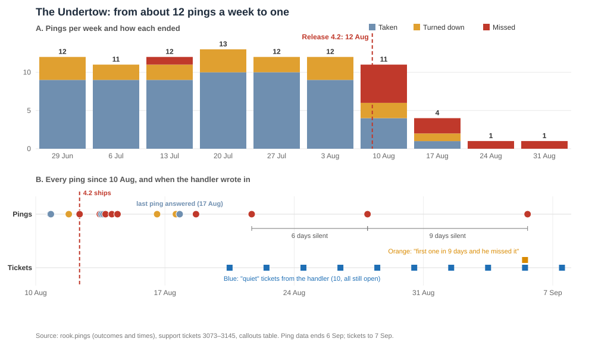

# Case study: The Undertow, 10 Aug to 6 Sep 2026

**In one line:** The Undertow went from about 12 callout offers a week to one, after five missed offers in the three days following the 4.2 release. Nothing has been taken since 17 Aug, and the handler has written in 11 times about it, all still open.

## Before 4.2
About 12 offers a week, and about three in four answered "yes" (58 taken out of 75 before 12 Aug). One missed offer in six weeks. Handler: Desmond Okafor.

## Week by week
**Week of 10 Aug (4.2 ships Wednesday).** Monday went normally: two jobs taken. On Wednesday morning, the first missed offer. By Friday there were five misses in three days, though The Undertow also took two jobs on Thursday afternoon. Three of the missed offers were for jobs nobody took, two in their own area (Harborside) on Thursday and one in Southport early Friday. The other missed offers moved on to the next responder.

**Week of 17 Aug.** Four offers. On Monday, one turned down, then one taken that evening: the last "yes" on record. Two more misses followed, on Tuesday and Friday, both in Harborside, and both jobs went to someone else. On Thursday the handler wrote in for the first time: six offers that week against a usual twelve.

**Week of 24 Aug.** One offer, at 11:18pm on Thursday. Missed. The handler wrote in every other day: "not gone off in 3 days" (Mon), The Undertow "asked me this morning whether his account is still active" (Wed), "I would rather know than guess" (Fri).

**Week of 31 Aug.** One offer, Saturday afternoon. Missed. It was the first in nine days. The handler passed on The Undertow's own words on 1 Sep: "starting to wonder if im still even in the system." Of the last four offers, all four were missed.

## What this cost
- **The Undertow:** 20 days without a job taken. Fourteen offers since 12 Aug: 3 taken, 2 turned down, 9 missed.
- **Callouts:** three callouts in the first burst had nobody take them. Others waited for a second or third offer.
- **The handler:** 11 tickets in three weeks, all still open. The data doesn't show whether anyone replied. A separate ticket about a double charge on the invoice was closed.
- **The system:** under the rules in the code, a miss counts the same as a "no", and the score never recovers by itself. My estimate is that this burst would push a top-ranked responder close to the bottom of the list within about ten days. That is an estimate. The real scores are not in the data.

## What we don't know
Whether The Undertow's first misses came from the shorter 60-second window, a phone problem or being away from the phone. The data has no response times, so it can't say.

## Why The Undertow
Their trail is the most complete of the four quiet responders: ping-by-ping records, 11 handler tickets that match the ping dates exactly, the longest silence (8.7 days), and jobs in their own area that went unfilled. Farlight is nearly as well documented, with a shorter silence (5.2 days) and fewer offers after the release. Vesper and Meteor Mite have interviews but no tickets. The Undertow is the most extreme case, not the typical one.
